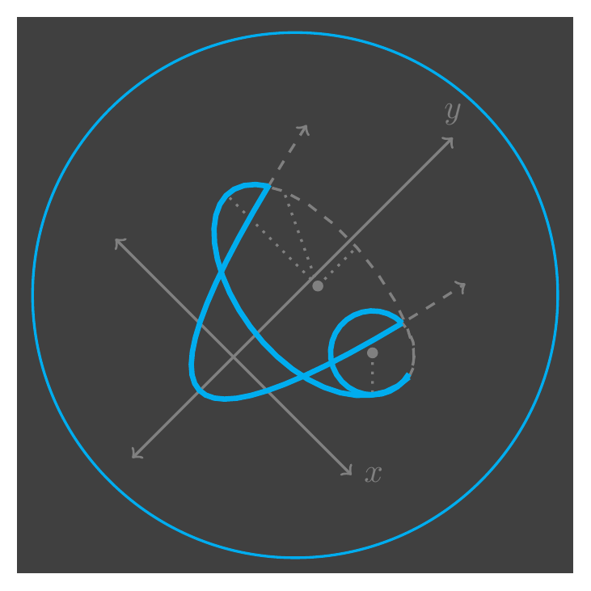

# and-e
LaTeX source code to create the following image:


Alternatively, generate a cicular shape:


## To generate
Run the following:
```bash
$ pdflatex ande.tex
$ pdftoppm ande.pdf ande -png -r 300
$ mv ande-1.png ande.png
```
Alternatively, use the Makefile. For the latex requirements,
`texlive-latex-extra` is sufficient.
